# Logical ERD

```mermaid
erDiagram
  organizations ||--o{ workspaces : owns
  auth_users ||--|| user_profiles : has
  workspaces ||--o{ workspace_memberships : has
  user_profiles ||--o{ workspace_memberships : joins
  workspaces ||--o{ legal_entities : contains
  workspaces ||--o{ brands : contains
  workspaces ||--o{ locations : contains
  workspaces ||--|| workspace_settings : configures
  workspaces ||--o{ workspace_feature_entitlements : enables
  workspaces ||--o{ workspace_configuration_versions : versions
  workspace_configuration_versions ||--o{ workspace_configuration_changes : contains
  workspace_configuration_versions ||--o{ workspace_configuration_activations : activates

  workspaces ||--o{ vehicles : records
  vehicles ||--o{ inventory_units : held_as
  locations ||--o{ inventory_units : located_at
  inventory_units ||--o{ inventory_cost_entries : incurs
  inventory_units ||--o{ vehicle_media : has
  inventory_units ||--o{ channel_listings : publishes

  workspaces ||--o{ parties : contains
  parties ||--o{ party_contacts : has
  parties ||--o{ party_relationships : relates
  parties ||--o{ leads : prospect
  leads ||--o{ activities : creates
  leads ||--o{ tasks : requires
  leads ||--o| deals : converts_to

  workspaces ||--o{ deals : contains
  deals ||--o{ deal_participants : has
  parties ||--o{ deal_participants : participates
  deals ||--o{ deal_inventory_units : includes
  inventory_units ||--o{ deal_inventory_units : involved_in
  deals ||--o{ trade_ins : includes
  deals ||--o{ finance_applications : may_have
  deals ||--o{ payment_transactions : records

  workspaces ||--o{ document_types : configures
  document_types ||--o{ document_template_versions : renders_with
  deals ||--o{ documents : produces
  documents ||--o{ document_files : has
  documents ||--o| calculation_snapshots : may_have
  documents ||--o| tax_calculation_snapshots : may_have

  workspaces ||--o{ workflow_definitions : configures
  workflow_definitions ||--o{ workflow_versions : versions
  workflow_versions ||--o{ workflow_states : contains
  workflow_versions ||--o{ workflow_transitions : permits
  workflow_versions ||--o{ workflow_instances : runs
  workflow_instances ||--o{ workflow_events : emits

  workspaces ||--o{ integration_connections : connects
  integration_connections ||--o{ external_resources : maps
  workspaces ||--o{ jobs : queues
  workspaces ||--o{ audit_events : audits
```

## Modeling rules

- VIN identifies a physical vehicle but does not prevent a later holding episode.
- Stock numbers belong to inventory units.
- A deal can include several parties and inventory roles.
- Documents reference immutable template, tax, formula, workflow, and renderer versions.
- Provider identifiers live in mapping tables, not vehicle rows.
- Runtime workspace configuration is stored in database versions; Git seed packages are optional provisioning inputs only.
